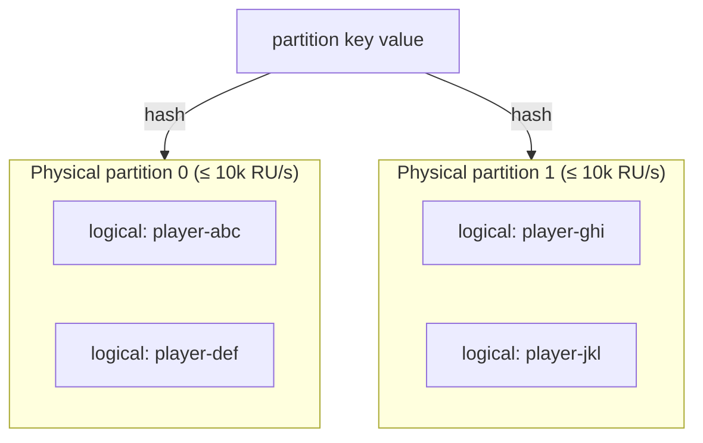

I have a confession: I once shipped a CosmosDB container with a partition key that
looked perfect. It passed code review. It passed the load test. It sailed through
the first week of production. Then real traffic showed up, skewed in exactly the
way real traffic always does, and my "perfect" key started handing out `429 Too
Many Requests` like candy — while the throughput chart insisted I had plenty of
RUs to spare.

That gap between "I provisioned enough throughput" and "my requests are getting
throttled anyway" is the whole story of partitioning in CosmosDB. If you
understand the two-layer model underneath your container — and the two limits
that fall out of it — you can avoid the mistake I made. So let's walk through it,
starting with the part the docs gloss over.

## Logical partitions vs physical partitions

CosmosDB has two kinds of partitions, and conflating them is where most of the
pain begins.

A **logical partition** is just every item that shares the same partition key
value. If your key is `/playerId`, then every row for `playerId: "abc"` lives in
the same logical partition. You don't provision these, you don't see them in the
portal — they exist purely because you chose a key.

A **physical partition** is the actual compute-and-storage box (a set of replicas)
that CosmosDB spins up behind the scenes. CosmosDB hashes your partition key value
and maps each logical partition onto exactly one physical partition. You don't
control how many physical partitions you get — CosmosDB adds them as your data and
throughput grow.



The mental model I use: **logical partitions are how you address your data,
physical partitions are where it actually lives.** Many logical partitions land on
one physical partition. You pick the key; CosmosDB picks the boxes. The trick is
that the limits you'll actually hit live on *both* layers.

## The two limits that actually matter

Almost everything that goes wrong with sharding traces back to one of two ceilings.

| Limit | Lives on | The number | What blows it |
|-------|----------|------------|----------------|
| **Storage** | A single logical partition | **20 GB** | One partition key value accumulating unbounded data |
| **Throughput** | A single physical partition | **~10,000 RU/s** | One key value taking a disproportionate share of traffic |

The storage one is easy to picture: pick `/gameId` for a wildly popular game and
that one logical partition keeps growing until it slams into 20 GB — and there's
no "just add more space," because a logical partition can't span physical
partitions.

The throughput one is sneakier, and it's the one that bit me. Here's the part that
isn't obvious: **provisioned RU/s is split evenly across your physical
partitions.** Provision 30,000 RU/s, get three physical partitions, and each one
caps out around 10,000 RU/s — no matter how lopsided your traffic is. So if a
single hot partition key value routes all its load to one physical partition, that
key can only ever draw ~10k RU/s. The other 20k sits there, fully paid for,
completely useless to you. Your dashboard says 33% utilization; your callers see
429s. Cool. Cool cool cool.

## What makes a partition key good

Once you internalize those two limits, a good partition key is just one that keeps
you far away from both. Three properties to weigh:

| Property | Why it matters | Smell test |
|----------|----------------|------------|
| **High cardinality** | More distinct values → more logical partitions → CosmosDB can spread you across more physical partitions | "How many distinct values will this realistically have? Dozens, or millions?" |
| **Even access distribution** | Stops any one value from monopolizing a physical partition's RUs | "Will traffic be roughly balanced across values, or will 5% of them take 95% of the load?" |
| **Query alignment** | Queries that filter on the key hit one partition instead of fanning out across all of them | "Does my hottest query already filter by this field?" |

The tension is that these three pull against each other. `/playerId` has gorgeous
cardinality and balances load beautifully — right up until your most common query
is "give me the top 100 for this leaderboard," which doesn't filter by player at
all and now fans out across every partition. Meanwhile `/leaderboardId` makes that
query a single-partition read, but a hit leaderboard becomes exactly the hot,
ever-growing partition that detonates both limits at once.

***Pick the key that keeps your highest-volume access pattern on a single
partition — but only if that key also spreads load and storage. When you can't get
all three, cardinality and even distribution win, because a fan-out query is a
cost problem, while a hot partition is an outage.***

## When you can't win cleanly: synthetic keys

Sometimes the field you *want* to partition on is inherently lopsided. A handful of
mega-popular games, one viral leaderboard, that one tenant who is 40% of your
traffic. The escape hatch is a **synthetic partition key**: instead of partitioning
on the raw value, you partition on a derived one that artificially spreads the hot
value across multiple logical partitions.

The simplest version appends a bucket suffix to the hot field:

```csharp
// Spread a single hot leaderboardId across N logical partitions
// by suffixing a deterministic bucket. Tune N to your write volume.
const int BucketCount = 10;

string SyntheticKey(string leaderboardId, string entryId)
{
    int bucket = Math.Abs(entryId.GetHashCode()) % BucketCount;
    return $"{leaderboardId}-{bucket}";
}
```

Stored on the item, that looks like:

```json
{
  "id": "entry-9f2c",
  "leaderboardId": "global-spring-event",
  "pk": "global-spring-event-7",
  "score": 14820
}
```

Now one screaming-hot leaderboard becomes ten logical partitions that can land on
up to ten physical partitions — roughly 10× the throughput headroom and 10× the
storage runway. The cost is on reads: fetching the whole leaderboard means querying
all `N` buckets and merging, so you only reach for this when the write/storage
skew genuinely forces your hand. It's a trade, not a freebie.

## The part that makes all of this scary: it's a one-way door

Here's the line I wish someone had bolded for me before I shipped: **you cannot
change the partition key of an existing CosmosDB container.** There's no `ALTER`,
no setting, no support ticket. The key you chose is the key that container has
forever.

That said, the door has a fire exit — and it's worth knowing where it is before
the room fills with smoke. The **change feed** gives you an ordered, replayable log
of every create and update in a container. Point a change-feed processor at a
brand-new container that has the *right* key, and it'll copy every existing
document across and then keep streaming new writes as they land. So the real
migration looks like this: stand up the new container, run the change feed to
backfill and stay caught up, let it ride until the lag is near zero, then cut your
reads — and finally your writes — over to the new container. The Cosmos DB Spark
connector and the hosted data-migration jobs both lean on exactly this mechanism.

It works. I've done it. But notice how much weight "the escape hatch exists" is
quietly carrying in that sentence — you're still running a live dual-container
migration, reconciling feed lag, and holding your breath through the cutover, all
while traffic keeps pouring in. The fire exit gets you out of the building; it
doesn't mean you wanted the fire.

Which is exactly why partition key choice deserves the kind of attention we
normally reserve for, say, a public API contract. Most design mistakes are a deploy
away from being fixed. This one is a data migration away. Treat the decision like
the one-way door it is: spend the extra hour up front modeling your real access
patterns, your real cardinality, and where your traffic actually skews — because
the alternative is spending a very long week earning that knowledge in production.

If you only remember one thing: **provisioned throughput is a promise about your
average; partition keys are what decide whether any single hot value can ever cash
it in.** Pick the key that keeps your hottest data spread, and you'll never meet the
version of me that's staring at a 33%-utilized container throwing 429s at 2am.

## Feedback

This one comes from a scar, so I'd genuinely love to hear how others have
approached partition key design — especially the synthetic-key trade-offs at scale.
If you have thoughts, war stories, or corrections, reach out on GitHub or LinkedIn,
linked below!
