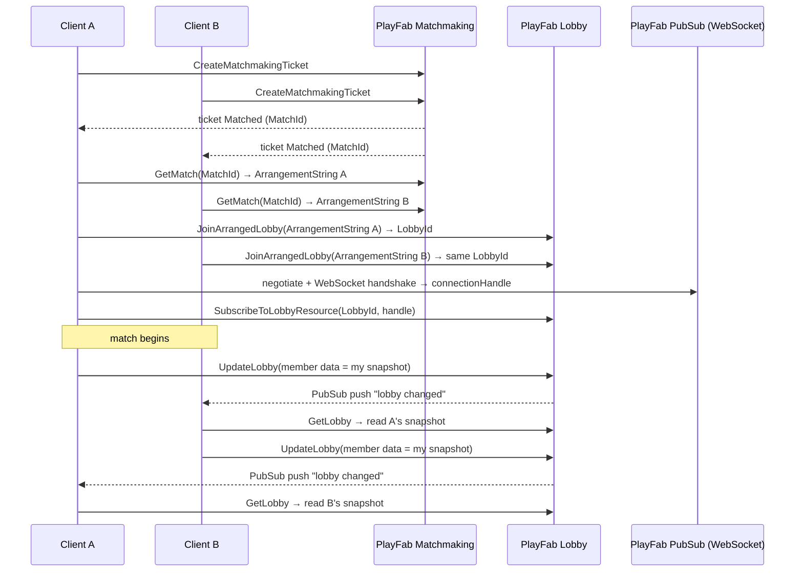

Every few months someone on a small game team asks me the same question: *"We want
player-vs-player with live state, but we don't want to stand up and babysit a fleet
of game servers. What's the cheapest path that isn't a toy?"*

This is my answer. It's the flow I keep reaching for when the game is turn-based or
lightly real-time and the shared state per tick is small. It runs entirely on
[PlayFab](https://learn.microsoft.com/gaming/playfab/) primitives, talks nothing but
REST and a single WebSocket, and needs **no PlayFab SDK, no PlayFab Party, and no
dedicated servers**. It's engine-agnostic on purpose — the snippets below are
pseudo-code and raw HTTP, so a human or a coding agent can port them to any stack.

The mental model that makes it click: PlayFab hands you three composable building
blocks, and the whole trick is chaining them.

- **Matchmaking** answers *who do I play with* and hands you a `MatchId`.
- **Lobby** is a shared key/value room with per-member data — your state channel.
- **PubSub** is a SignalR WebSocket that pushes "this lobby changed" — the doorbell.

Wire those three together and you get low-latency multiplayer state relay for a
handful of players without operating a single box of your own.

## Know what this is good for (and what it isn't)

I want to be honest about the envelope before you fall in love with the architecture,
because picking the wrong tool here is the expensive mistake, not the implementation.

What you get:

- Players queue up and are matched by a rule set you define.
- Every matched player lands in **one shared lobby** — no host election, no manual
  connection-string passing.
- Each player writes their own small state blob into **member data**; everyone else
  is pushed a notification and reads it back.
- Updates feel instant (WebSocket push) and degrade gracefully to polling.

This is ideal for turn-based or lightly real-time games — puzzle races, card games,
quizzes, board games — where the shared state per tick is **hundreds of bytes a few
times a second**, not a 60 Hz physics stream. The moment you need fast-action netcode,
stop reading and go get PlayFab Party or a real netcode layer. Don't try to bend a
key/value lobby into a rollback simulation; you'll lose.

Here's the end-to-end flow I'll build out in the rest of the post:



## Prerequisites and the auth model

Three things before you write any match code:

1. **A PlayFab title.** You need its **Title ID** (e.g. `A8129`). Every REST call goes
   to `https://<TITLEID>.playfabapi.com`.
2. **Authentication.** Every player must be logged in. Any PlayFab login works; for a
   zero-friction start I use an anonymous device login (`LoginWithIOSDeviceID`,
   `LoginWithAndroidDeviceID`, or `LoginWithCustomID`). From the login response, keep
   the **`SessionTicket`**, then call `GetEntityToken` to get an **`EntityToken`** and
   the player's **entity key** (`{ Id, Type: "title_player_account" }`). The entity
   token plus entity key are the currency that Matchmaking, Lobby, and PubSub all spend.
3. **A matchmaking queue.** One per game mode (next section).

The auth split trips people up the first time, so internalize it early:

| API family            | Header          | Value           |
| --------------------- | --------------- | --------------- |
| Classic Client API    | `X-Authorization` | `SessionTicket` |
| Entity APIs (Match, Lobby, PubSub) | `X-EntityToken` | `EntityToken` |

Everything is `POST` with `Content-Type: application/json`. Successful responses are
wrapped in an envelope: `{ "code": 200, "data": { ... } }` — the payload you care about
lives under `data`. (There's exactly one exception, and it will bite you. We'll get
there.)

## One-time setup: create the queue

A **queue** defines team sizes and matching rules. You create it once as an admin
operation using your **title entity token**, which is derived from your *secret key* —
not a player login. Do this from a trusted context: a build script or the Game Manager
UI. **Never ship the secret key in a client.** I'll repeat that later because it's the
kind of mistake that ends up in a postmortem.

`POST /Match/SetMatchmakingQueue`

```jsonc
{
  "MatchmakingQueue": {
    "Name": "versus_default",     // your queue name, referenced by every ticket
    "MinMatchSize": 2,
    "MaxMatchSize": 2,
    "ServerAllocationEnabled": false,
    "Teams": null,
    "StatisticsVisibilityToPlayers": {
      "ShowNumberOfPlayersMatching": true,
      "ShowTimeToMatch": true
    }
  }
}
```

A few things I've learned to do by default:

- **One queue per game mode** (`versus_chess`, `versus_race`, …) so players only match
  against the right opponents.
- **Start with the simplest possible rule set** — just team size. Add skill/latency
  rules later, once the basic flow is proven. Premature matchmaking rules are a great
  way to debug an empty queue forever.
- If a ticket comes back `MatchmakingQueueNotFound`, the queue name is wrong or the
  queue was never created. Check the obvious thing first.

## Finding an opponent

### Create a ticket

`POST /Match/CreateMatchmakingTicket` (header: player `X-EntityToken`)

```jsonc
{
  "QueueName": "versus_default",
  "GiveUpAfterSeconds": 30,
  "Creator": {
    "Entity": { "Id": "<PLAYER_ENTITY_ID>", "Type": "title_player_account" },
    "Attributes": { "DataObject": {} }   // matchmaking attributes go here if your rules use them
  }
}
```

Response: `{ "TicketId": "..." }`.

### Poll until matched

`POST /Match/GetMatchmakingTicket`

```jsonc
{ "TicketId": "<TICKET_ID>", "QueueName": "versus_default", "EscapeObject": false }
```

Poll about **once per second**. You're waiting for `Status: "Matched"`:

```jsonc
{
  "Status": "Matched",
  "MatchId": "bd8d9094-....",
  "Members": [ { "Entity": { "Id": "...", "Type": "title_player_account" } }, ... ]
}
```

The other statuses you'll see are `WaitingForPlayers`, `WaitingForMatch`, and
`Canceled`. When a player times out or backs out, **cancel the ticket** so it can't
linger and poach the next match — this is a real bug I've watched ship, and it's in the
gotchas section below:

`POST /Match/CancelAllMatchmakingTicketsForPlayer`

```jsonc
{ "QueueName": "versus_default", "Entity": { "Id": "...", "Type": "title_player_account" } }
```

One warning that will save you an afternoon: **don't rely on `Members` to identify
opponents.** Depending on timing, it can come back without the other player's id. Derive
your opponent slots from the match size instead, and fill them from lobby membership.
More on why this matters in the gotchas.

## Getting everyone into one lobby

This is the crux of the whole design, and it's the part I most often see done the hard
way. After a match, **every player asks PlayFab for their own signed "arrangement
string" for that match, then joins an arranged lobby with it.** PlayFab guarantees that
all players using the same match's arrangement strings land in the **same lobby** —
the first one in creates it, the rest join. No host election. No exchanging connection
strings out of band.

### Get your arrangement string

`POST /Match/GetMatch`

```jsonc
{ "MatchId": "<MATCH_ID>", "QueueName": "versus_default" }
```

The response includes `ArrangementString` — a signed, per-caller token. A's string
differs from B's, and that's expected; both still resolve to the same lobby.

### Join the arranged lobby

`POST /Lobby/JoinArrangedLobby`

```jsonc
{
  "ArrangementString": "<YOUR_ARRANGEMENT_STRING>",
  "MemberEntity": { "Id": "<PLAYER_ENTITY_ID>", "Type": "title_player_account" },
  "MaxPlayers": 2,
  "OwnerMigrationPolicy": "Automatic",
  "AccessType": "Private",
  "UseConnections": true
}
```

Response: `{ "LobbyId": "..." }` — identical for every matched player.

`UseConnections: true` is **required** when `OwnerMigrationPolicy` is `Automatic` or
`Manual`. It's also what makes the lobby eligible for PubSub change notifications, so I
always set it. Treat it as non-optional.

### Why not CreateLobby + JoinLobby?

You *can* elect a host, have it `CreateLobby`, and broadcast the returned
`ConnectionString` for the others to `JoinLobby`. I've shipped it. I won't again for
anything that came out of matchmaking. That design needs an out-of-band channel to pass
the connection string around, and the non-host join becomes a quiet failure point: if it
throws, that player silently drops out of the shared room while the host happily thinks
the match is on. `JoinArrangedLobby` deletes that entire class of bug. **Prefer it.**

## Relaying live state through member data

A lobby has **per-member data** — a small string→string map that each player owns and
others can read. That's your state channel. It's not glamorous, but it's exactly enough.

### Publish your state

`POST /Lobby/UpdateLobby`

```jsonc
{
  "LobbyId": "<LOBBY_ID>",
  "MemberEntity": { "Id": "<PLAYER_ENTITY_ID>", "Type": "title_player_account" },
  "MemberData": { "snap": "<your serialized state, e.g. compact JSON>" }
}
```

### Read everyone's state

`POST /Lobby/GetLobby`

```jsonc
{ "LobbyId": "<LOBBY_ID>" }
```

Response (trimmed):

```jsonc
{
  "Lobby": {
    "Members": [
      { "MemberEntity": { "Id": "A..." }, "MemberData": { "snap": "..." } },
      { "MemberEntity": { "Id": "B..." }, "MemberData": { "snap": "..." } }
    ]
  }
}
```

Iterate members, skip your own entity id, deserialize each `snap`, and apply it to the
matching opponent.

### Designing the snapshot payload

The payload design is where most of the engineering judgment actually lives:

- **Keep it tiny** — a few hundred bytes. Flatten grids to arrays of small ints, use
  short keys (`p`, `s`, `f`), and drop anything the receiver can derive itself.
- **Only send what's safe to reveal mid-match.** In a word or number game, send the
  *colors/marks*, never the actual letters — otherwise you've just handed the opponent
  the answer key over the wire. Your state channel is also your cheating surface.
- **Serialize deterministically.** This sounds like a nitpick. It is not. It's the
  single most expensive bug in this whole design, and it gets its own entry below.

## Making it feel instant: the PubSub WebSocket

Polling `GetLobby` works, but it's laggy and it burns your rate budget. PlayFab PubSub
is a **SignalR-over-WebSocket** channel that pushes a notification whenever a subscribed
lobby changes; you then fetch once, on demand. There's no SDK requirement — the wire
protocol is small enough to speak directly, and I'd rather own those ~40 lines than take
a dependency for them.

### Negotiate

`POST /PubSub/Negotiate` (header: `X-EntityToken`, body `{}`).

Here's the exception I promised: the negotiate response is **not** wrapped in the usual
`data` envelope. Read `url` and `accessToken` from the top level.

```jsonc
{ "url": "https://pubsub-signalr-...service.signalr.net/client/...", "accessToken": "..." }
```

### Open the socket and handshake

Connect a WebSocket to the negotiated URL, converting `https://` → `wss://` and
appending the access token:

```
wss://<negotiated host>/client/...&access_token=<accessToken>
```

SignalR frames are **JSON terminated by the record-separator byte `0x1e`** (shown below
as `␞`). Immediately send the protocol handshake:

```
{"protocol":"json","version":1}␞
```

The server replies with an empty object `{}␞` to acknowledge. On that ack, start a
session to obtain a **connection handle**:

```
{"type":1,"target":"StartOrRecoverSession","arguments":[{"traceParent":"00-<32 hex>-<16 hex>-01","oldConnectionHandle":null}],"invocationId":"h"}␞
```

The reply carries your handle:

```jsonc
{ "invocationId": "h", "result": { "newConnectionHandle": "1.Y2Vud..." } }
```

(`traceParent` is a W3C trace-context string; random hex works fine.)

### Subscribe the lobby to this connection

Back on the REST API:

`POST /Lobby/SubscribeToLobbyResource`

```jsonc
{
  "Type": "LobbyChange",
  "EntityKey": { "Id": "<PLAYER_ENTITY_ID>", "Type": "title_player_account" },
  "ResourceId": "<LOBBY_ID>",
  "SubscriptionVersion": 1,
  "PubSubConnectionHandle": "<newConnectionHandle>"
}
```

Now, whenever the lobby changes, the socket receives a frame with
`"target":"ReceiveMessage"`. Treat that as **"refetch the lobby"** and call `GetLobby`
once. Resist the urge to parse state out of the push itself — the push is a doorbell,
not a payload.

### Keep the socket alive

**This is the one that bites everyone, including me, the first time.** The SignalR
service closes idle connections within ~15–30 s. Send a ping frame on a short interval
(≈5 s is safe):

```
{"type":6}␞
```

Skip it and the socket silently dies a few seconds into the match, updates stop, and
there's no error anywhere in your own code to point you at it. If you decide to skip
PubSub entirely, fall back to polling `GetLobby` every couple of seconds.

### The relay loop

Here's the whole thing in pseudo-code. Notice how small it is — that's the point.

```text
on match start:
    connect pubsub (with a hard timeout, e.g. 6s); on success subscribe(lobbyId)
    pendingFetch = false
    pubsub.onLobbyChanged = () => pendingFetch = true

    loop every 1s while match running:
        snap = serialize(myState)            # deterministic!
        if snap != lastSnap:
            UpdateLobby(memberData = { snap })
            lastSnap = snap
        if pendingFetch or (not connected and slowPollTick):
            members = GetLobby().members
            for m in members where m.id != myId:
                applyOpponent(m.data.snap)
            pendingFetch = false

    pubsub.close()   # also stop the keepalive ping
```

## Hard-won gotchas (read this section twice)

These are the bugs that cost me real time. None of them are obvious from the API docs,
and most of them masquerade as a different problem than they are.

1. **Serialize snapshots deterministically.** If your JSON encoder emits keys in random
   order, the *string* changes every tick even when the *state* didn't. You then call
   `UpdateLobby` every single tick, blow through the rate limit, and PlayFab starts
   returning **HTTP 429** on your `GetLobby` reads — so opponents appear frozen. Use
   sorted/stable key ordering and only publish when the serialized value actually
   changes. This one bug produces three different-looking symptoms.

2. **Respect the lobby rate limit.** Lobby read/write is rate-limited per entity. With
   two players each pushing and each pulling-on-push, it's easy to exceed. Budget for
   roughly **≤1 request per second per client**: publish only on change, fetch only on a
   push (plus a slow safety poll). Treat a 429 as "back off," not "retry immediately."

3. **Keep the WebSocket alive.** No ping → dead socket in ~20–30 s → no more pushes. The
   tell is unmistakable once you know it: the first few updates work, then nothing.

4. **Always time-box the socket handshake.** If the handshake stalls, don't let your
   relay block forever waiting for the connection handle. Cap it (e.g. 6 s) and fall
   back to polling. Otherwise one bad negotiate hangs the entire match with zero updates.

5. **Don't trust matchmaking `Members` for opponent identity.** The ticket's member list
   can come back without opponent ids. Create your opponent slots from
   **match size − 1** and fill them positionally from lobby membership. If you key
   opponents strictly by the ticket's ids and they're missing, every incoming snapshot
   is silently dropped and the opponent looks idle. This masquerades as "the relay is
   broken" when it's actually "there was no slot to put the data in."

6. **Use `JoinArrangedLobby`, not host-elected `CreateLobby`/`JoinLobby`** for matchmade
   games. The non-host join is the classic point where one player silently fails to enter
   the shared room.

7. **`UseConnections: true` is mandatory** with automatic/manual owner migration, and is
   what enables change notifications. Forgetting it gives you confusing bad-request
   errors or a lobby that never pushes.

8. **The negotiate response isn't enveloped.** Read `url`/`accessToken` from the top
   level, unlike every other call where you read `data.*`.

9. **Never ship your secret key.** Queue creation and other admin calls use the *title*
   entity token derived from the secret key. Do that server-side or in tooling. Clients
   only ever touch a player session ticket / entity token.

## Testing tips

A little discipline here turns "it doesn't work" into a one-line answer:

- **Use two fixed test accounts** (e.g. two `LoginWithCustomID` ids) for repeat testing,
  so you don't inflate your title's player counts with throwaway accounts and so
  matchmaking always has a predictable pair.
- **Two emulators/simulators** can fully exercise the flow — each gets its own anonymous
  identity. A phone plus an emulator works too.
- **Log the relay, not the render loop.** Log the chain: socket connected? push received?
  members fetched? snapshot decoded? slot applied? Almost every failure is one specific
  link, so instrument each link.
- **Verify the backend independently.** A 30-line script that logs in two accounts,
  tickets them, joins the arranged lobby, has A `UpdateLobby` and B `GetLobby`, and
  asserts B sees A's data will prove the server flow before you waste time blaming the
  client.

## Endpoint quick reference

| Step                | Endpoint                                       | Auth header        |
| ------------------- | ---------------------------------------------- | ------------------ |
| Login (anon)        | `/Client/LoginWith*DeviceID` / `LoginWithCustomID` | TitleId in body |
| Get entity token    | `/Authentication/GetEntityToken`               | `X-Authorization`  |
| Create queue (admin)| `/Match/SetMatchmakingQueue`                   | title `X-EntityToken` |
| Create ticket       | `/Match/CreateMatchmakingTicket`               | `X-EntityToken`    |
| Poll ticket         | `/Match/GetMatchmakingTicket`                  | `X-EntityToken`    |
| Cancel tickets      | `/Match/CancelAllMatchmakingTicketsForPlayer`  | `X-EntityToken`    |
| Get match / arr str | `/Match/GetMatch`                              | `X-EntityToken`    |
| Join arranged lobby | `/Lobby/JoinArrangedLobby`                     | `X-EntityToken`    |
| Publish state       | `/Lobby/UpdateLobby`                           | `X-EntityToken`    |
| Read state          | `/Lobby/GetLobby`                              | `X-EntityToken`    |
| PubSub negotiate    | `/PubSub/Negotiate`                            | `X-EntityToken`    |
| Subscribe lobby     | `/Lobby/SubscribeToLobbyResource`              | `X-EntityToken`    |

All under `https://<TITLEID>.playfabapi.com`, all `POST`, all JSON. Responses are
`{ code, status, data }` except `/PubSub/Negotiate` (top-level).

## The whole trick, in four sentences

- **Matchmaking** answers *who do I play with* and hands you a `MatchId`.
- **Arranged Lobby** turns that match into *one shared room* everybody reliably joins,
  with no host handshake.
- **Member data** is your *state channel* — small, owner-writable, world-readable.
- **PubSub** is the *doorbell* — it tells you the room changed so you can read it
  immediately instead of polling.

Keep payloads tiny, serialize them deterministically, publish on change, fetch on push,
and keep the socket warm. Do that and you've got real-time-enough multiplayer running on
infrastructure you never have to wake up for at 3 a.m. That's the whole point.
